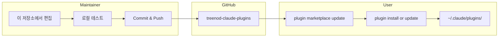
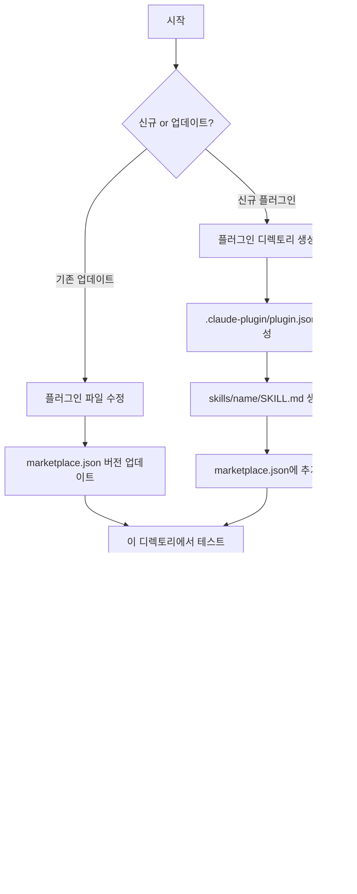
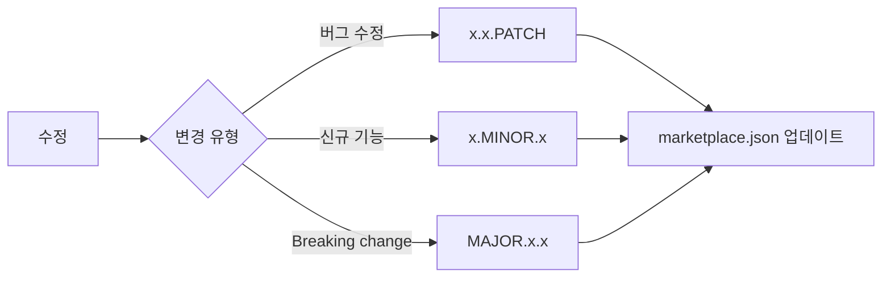
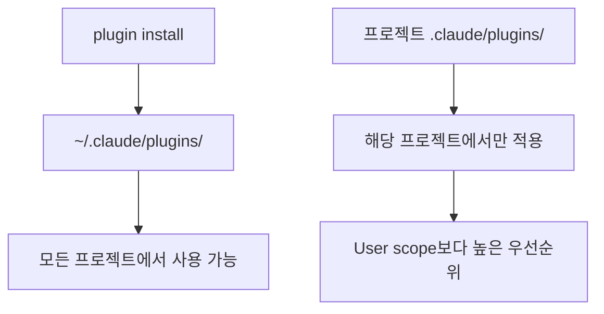

# Treenod Claude Code Plugins

Treenod 내부용 Claude Code 플러그인 마켓플레이스

## 플러그인 목록

| Plugin | Category | Description |
|--------|----------|-------------|
| atlassian | productivity | Confluence, Jira API 연동 |
| document-hoarder | productivity | Confluence 문서 로컬 동기화 |
| sheet | productivity | Google Sheets API 연동 |
| skill-creator | development | Claude Code skill 생성 가이드 |
| sql-writer | data | Databricks SQL 쿼리 생성기 |

## 디렉토리 구조

```
treenod-claude-plugins/
├── CLAUDE.md                     # Claude Code 컨텍스트
├── README.md                     # 이 문서
├── .claude-plugin/
│   └── marketplace.json          # 플러그인 카탈로그
└── plugins/
    └── <plugin-name>/
        ├── .claude-plugin/
        │   └── plugin.json       # 플러그인 매니페스트
        └── skills/
            └── <skill-name>/
                ├── SKILL.md      # Skill 정의
                ├── scripts/      # Python 스크립트
                └── references/   # 참조 문서
```

## 워크플로우 개요



## 관리자 가이드

### 개발 워크플로우



### 신규 플러그인 생성

```bash
# 1. 디렉토리 구조 생성
mkdir -p plugins/<name>/.claude-plugin
mkdir -p plugins/<name>/skills/<name>

# 2. plugin.json 생성
cat > plugins/<name>/.claude-plugin/plugin.json << 'EOF'
{
  "name": "<name>",
  "description": "플러그인 설명",
  "author": {
    "name": "Treenod Dev Team",
    "email": "your-email@treenod.com"
  }
}
EOF

# 3. SKILL.md 생성
cat > plugins/<name>/skills/<name>/SKILL.md << 'EOF'
---
name: <name>
description: Skill 설명
---

# Skill 제목

문서 내용...
EOF

# 4. marketplace.json의 plugins 배열에 추가
# 5. 이 디렉토리에서 Claude Code 실행하여 테스트
# 6. Commit and push
```

### 기존 플러그인 업데이트

```bash
# 1. 플러그인 파일 수정
# 2. marketplace.json 버전 업데이트
# 3. CHANGELOG.md 업데이트 (있는 경우)
# 4. 로컬 테스트
# 5. Commit and push
```

### 버전 관리



## 사용자 가이드

### 최초 설정

```bash
# 마켓플레이스 추가
/plugin marketplace add treenod-drew/treenod-market

# 설치 가능한 플러그인 목록 확인
/plugin

# 플러그인 설치
/plugin install atlassian@treenod-plugins
/plugin install sql-writer@treenod-plugins
```

### 플러그인 업데이트

```bash
# 마켓플레이스 카탈로그 갱신
/plugin marketplace update treenod-plugins

# 특정 플러그인 업데이트
/plugin update atlassian@treenod-plugins
```

### 설치 범위



## 사전 요구사항

### atlassian / document-hoarder
- `ATLASSIAN_USER_EMAIL`
- `ATLASSIAN_API_TOKEN`
- `JIRA_URL`

### sheet
- Google Cloud 프로젝트 (Sheets API 활성화)
- `gcloud` CLI 인증 완료

### sql-writer
- Databricks workspace 접근 권한
- Connection 설정 완료
